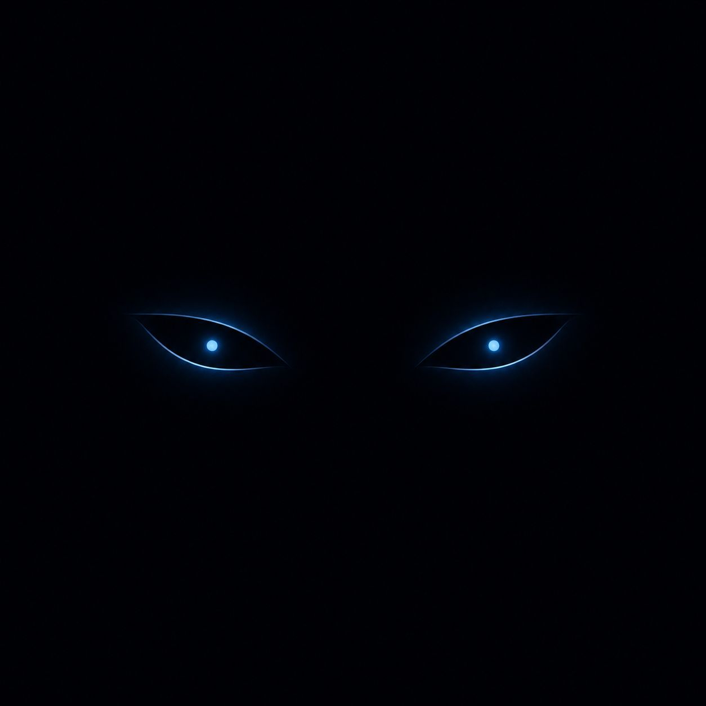

# കണ്ണ് (Kannu)

<p align="center">
  
</p>

**Kannu** is a macOS notch utility focused on **AI agent status** in the MacBook notch. It shows a traffic-light indicator while Cursor, VS Code Copilot, or Codex agents run, with optional custom notch backgrounds and mobile push notifications.

This project is licensed under GPL v3. See [LICENSE](LICENSE) and [NOTICE](NOTICE) for upstream attribution.

Kannu is a fork of [Atoll](https://github.com/Ebullioscopic/Atoll), which itself builds on the broader macOS notch lineage including [Boring.Notch](https://github.com/TheBoredTeam/boring.notch).

## Highlights

- **Agent status traffic light** — yellow (thinking), green (executing), red (stopped), fed by editor hooks and transcript polling.
- **Custom notch skins** — upload a background image clipped to the notch shape, with optional dark scrim for readability.
- **Mobile notifications (optional)** — push agent state changes to iPhone, Apple Watch, or Android via ntfy, Pushover, or a custom webhook.
- Media controls, live activities, lock screen widgets, stats, timers, clipboard, and shelf.
- **Keyboard shortcuts off by default** — enable globally in Settings → Shortcuts when you want hotkeys.

Calendar, terminal, and color picker features from the Atoll/Boring.Notch lineage are removed in this fork.

## Requirements

- macOS 14.0 or later (optimised for macOS 15+).
- MacBook with a notch, or a non-notch Mac using floating Dynamic Island pill mode.
- Xcode 15+ to build from source.
- Permissions as needed: Accessibility, Screen Recording, Music.

## Runtime Permissions (by Feature)

Kannu requests permissions only when you use the related feature. The app is not sandboxed, so most permissions are standard macOS privacy prompts (TCC) shown at runtime.

- **Accessibility** — required for hardware key interception and custom HUD/OSD replacement.
- **Screen Recording** — required for Screen Assistant screenshot capture. Screen-recording detection is separate and does not require this prompt.
- **Music (MusicKit)** — required for Apple Music animated artwork features.
- **Automation (Apple Events)** — required for Spotify/Apple Music controls and Apple Notes sync when those integrations are used.
- **Full Disk Access** — required only for custom Focus metadata and optional global Shelf behavior.
- **Files & Folders (Documents/Downloads)** — used by Shelf when Full Disk Access is not granted.
- **Bluetooth** — used for Bluetooth audio battery indicators.
- **Location (When In Use)** — used for lock screen weather.
- **Audio Capture** — used for real-time waveform/audio-activity features.
- **Developer Tools** — optional, used for advanced Focus detection mode.

For detailed prompts and one-click setup actions, open **Settings** in Kannu. Contributor docs are in [CONTRIBUTING.md](CONTRIBUTING.md).

## Build from Source

1. Open `DynamicIsland.xcodeproj` in Xcode.
2. Select the **Kannu** scheme and your Mac as the run destination.
3. Build and run (⌘R).

Application support data is stored under `~/Library/Application Support/Kannu/`. Agent status hooks write to `~/.kannu/agent-status/`.

## Releases (GitHub)

Pre-built DMGs are published via [GitHub Releases](https://github.com/Ebullioscopic/Atoll/releases) when a version tag is pushed.

### Publish a new release

1. Commit and push your changes (including `.github/assets/` branding files).
2. Create and push a version tag, for example:
   ```bash
   git tag v2.2.0
   git push origin v2.2.0
   ```
3. The [Release workflow](.github/workflows/release.yml) runs automatically:
   - Builds `Kannu.app` (Release configuration)
   - Packages `Kannu.dmg` via `scripts/create-dmg.sh`
   - Attaches the DMG to the GitHub Release for that tag

You can also trigger the workflow manually from the **Actions** tab (**Release** → **Run workflow**).

### Notes

- CI builds are unsigned (ad-hoc). macOS may require right-click → Open on first launch.
- For wider distribution, sign with a Developer ID certificate before tagging.
- Future distribution options (Homebrew, etc.) are planned for phase 2 — see [docs/PHASE2.md](docs/PHASE2.md).

## Quick Start

1. Launch Kannu and complete onboarding.
2. Open **Settings → Agent Status** and install editor hooks for Cursor (recommended).
3. Run an AI agent in Cursor — the notch shows the traffic-light status when collapsed.
4. Optionally upload a notch skin under **Settings → Appearance → Notch skin**.

## Mobile Notifications Setup

1. Open **Settings → Agent Status → Mobile Notifications**.
2. Enable mobile notifications and choose a provider:
   - **ntfy** — create a topic at [ntfy.sh](https://ntfy.sh) or self-host. Install the ntfy app on iPhone or Android and subscribe to your topic.
   - **Pushover** — use your user key and app token from [pushover.net](https://pushover.net).
   - **Webhook** — POST JSON `{ "state": "thinking", "title": "...", "body": "...", "timestamp": "..." }` to your URL.
3. Tap **Send test notification** to verify delivery.

Notifications are debounced (~2 seconds) and skip the inactive state unless you opt in. Apple Watch mirrors iPhone alerts when mirroring is enabled in Watch settings.

**Privacy:** Agent status stays on your Mac unless you enable outbound notifications. Public ntfy topics can be read by anyone unless you self-host with authentication.

## Phase 2 — Windows and Linux

See [docs/PHASE2.md](docs/PHASE2.md) for the planned shared `kannu-core` watcher and Tauri-based shells for Windows 11 and Linux.

## License

GPL v3 — see [LICENSE](LICENSE).

## Acknowledgments

Kannu is a fork of [Atoll](https://github.com/Ebullioscopic/Atoll) and inherits its architecture, notch interaction patterns, and many features from that project. Atoll and Kannu both trace back to [Boring.Notch](https://github.com/TheBoredTeam/boring.notch) and other open-source macOS notch projects listed in upstream documentation.
