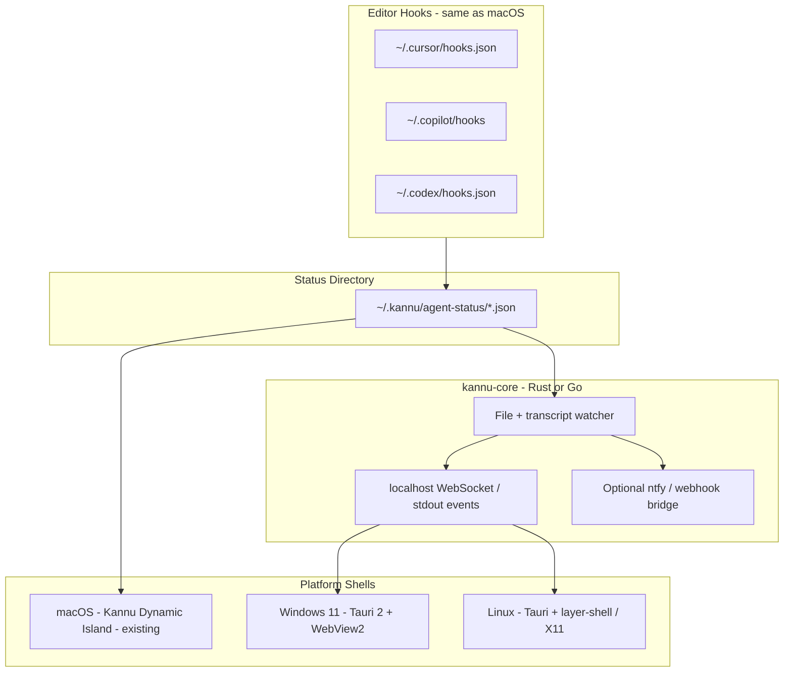

# Phase 2 — Windows and Linux Architecture

Kannu Dynamic Island (macOS) cannot be ported incrementally: the upstream app depends on AppKit, `NSScreen.safeAreaInsets`, private SkyLight APIs, and other macOS-only frameworks. Phase 2 introduces **platform-specific UI shells** that share a **common agent-status core**.

## Goals (v1)

- Closed pill with agent traffic-light only (matching Kannu external-display / Dynamic Island pill mode).
- Custom skin background (same image assets, synced manually or via shared config directory).
- Optional expandable panel for stats (later).
- No calendar, terminal, or color picker.

## Architecture



## Shared core (`kannu-core`)

Extract from the macOS `CursorAgentStatusMonitor` and `AgentHookInstaller` behavior:

| Responsibility | Details |
|----------------|---------|
| Watch status files | Monitor `~/.kannu/agent-status/*.json` (same hook JSON format as macOS) |
| Transcript fallback | Poll Cursor agent transcript directories when hooks are absent |
| State machine | Map raw events → `thinking` / `executing` / `stopped` / `inactive` |
| Emit events | WebSocket on `localhost` or newline-delimited JSON on stdout |
| Notifications | Reuse ntfy / Pushover / webhook logic from `AgentStatusNotificationBridge` |
| Config | Shared TOML/JSON under `~/.kannu/` (optional write path alongside `~/.kannu/`) |

Suggested stack: **Rust** (notify + tokio + tungstenite) or **Go** (fsnotify + gorilla/websocket) as a standalone CLI and library crate.

### Example event (WebSocket / webhook)

```json
{
  "state": "executing",
  "title": "Agent Executing",
  "body": "Your AI agent is running tools and doing work.",
  "timestamp": "2026-07-06T18:00:00Z",
  "source": "kannu-core"
}
```

## Platform UI shells

| Platform | UI | Notch behavior |
|----------|-----|----------------|
| **Windows 11** | Tauri 2 + WebView2 | Always-on-top centered pill (like Kannu `ExternalDisplayStyle.dynamicIsland`) |
| **Linux (Wayland)** | Tauri + wlr-layer-shell / GTK layer-shell | Floating pill above panel |
| **Linux (X11)** | Tauri + `_NET_WM_STATE_ABOVE` | Same floating pill |

Reference implementations in the macOS tree:

- `Kannu/components/Notch/DynamicIslandPillShape.swift` — pill geometry
- `Kannu/enums/generic.swift` — `ExternalDisplayStyle.dynamicIsland`
- `Kannu/components/AgentStatus/AgentTrafficLightLiveActivity.swift` — traffic-light UI spec

### Shell responsibilities

1. Subscribe to `kannu-core` WebSocket for state changes.
2. Render closed pill: skin background + three traffic-light dots.
3. Load skin image from `~/.kannu/skins/` or platform app-data dir.
4. Optional: system tray icon and settings window for ntfy topic / skin path.

## Skin asset sync

macOS stores skins under:

`~/Library/Application Support/Kannu/NotchSkins/`

Phase 2 shells can:

- Read the same files via a documented export path, or
- Share `~/.kannu/skins/` as the cross-platform config directory.

## Notification bridge reuse

The macOS `AgentStatusNotificationBridge` (ntfy, Pushover, webhook, 2s debounce) can be:

1. **Duplicated in `kannu-core`** for headless Linux/Windows daemons, or
2. **Invoked by each shell** when it receives state events from the core.

Prefer (1) so one config file drives notifications on all platforms.

## Suggested implementation order

1. Scaffold `kannu-core` CLI: watch `~/.kannu/agent-status/`, print state transitions to stdout.
2. Add WebSocket server and stable JSON schema.
3. Tauri pill prototype on Windows (always-on-top, click-through optional).
4. Port pill to Linux Wayland (test GNOME + KDE compositors early).
5. Skin loader + traffic-light component in the shell.
6. Shared notification config and test command.

## Risks

| Risk | Mitigation |
|------|------------|
| Wayland compositor differences | Test GNOME, KDE, and Hyprland; abstract layer-shell behind a small platform module |
| Windows always-on-top / DPI | Use Tauri 2 multi-monitor APIs; pin to primary display center |
| Hook path divergence | Keep reading `~/.kannu/agent-status/`; document optional `~/.kannu/agent-status/` mirror |
| GPL compliance | Shell repos that link/copy macOS UI assets must remain open source if distributed |

## macOS relationship

The existing Swift app remains the full-featured macOS shell. `kannu-core` is additive: macOS can optionally consume the same WebSocket for testing, but production macOS continues to use `CursorAgentStatusMonitor` in-process.
